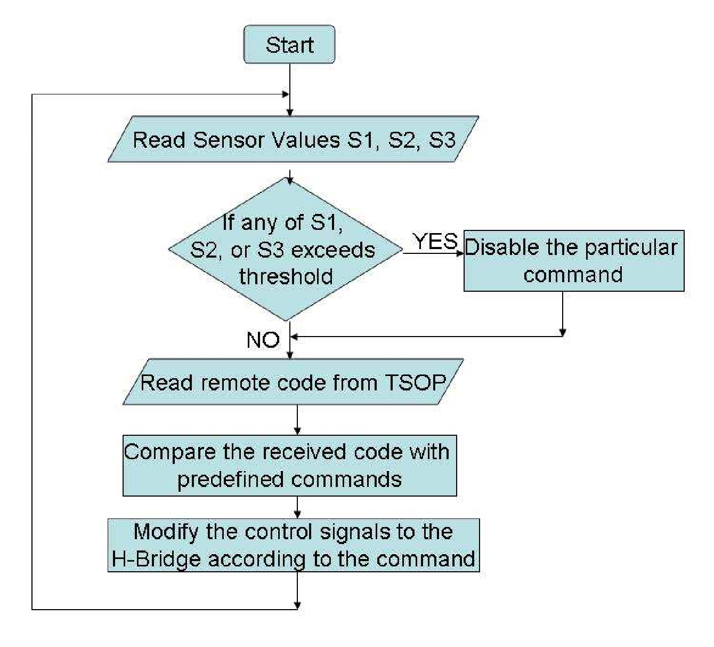

# TV-Remote Controlled Rover with Obstacle Detection

A B.Tech mini project from 2010–2011 that implements an infrared TV-remote controlled two-wheel rover with onboard obstacle detection using an ATmega328P microcontroller, TSOP1738 IR receiver, L293D motor driver, and IR proximity sensors.

  

## Overview

This project was developed as part of the Bachelor of Technology program in Electronics & Communication Engineering at the Federal Institute of Science and Technology (FISAT), affiliated with Mahatma Gandhi University. The rover can be driven using a standard TV remote, while onboard obstacle sensors help prevent collisions by disabling unsafe movement directions when an obstruction is detected.

## Team

- Johaan J.J.
- Jyothis George Thaliath
- Sarath N.S.
- Shyamprasad M.P.

## Project Objective

The goal of this project was to design and build a small embedded rover that combines remote operation with basic collision avoidance. Instead of acting as a simple remote-control vehicle, the rover adds a layer of safety by sensing obstacles in its path and preventing motion commands that would lead to impact.

## Features

- TV remote based motion control.
- Forward, backward, left, and right movement.
- Idle state when the remote button is released.
- Front and side obstacle detection.
- Variable sensor sensitivity for obstacle threshold tuning.
- ATmega328P-based embedded control.
- L293D motor driver based dual DC motor drive.

## Hardware Used

| Component | Purpose |
|---------|---------|
| ATmega328P | Main microcontroller |
| TSOP1738 | IR receiver for TV remote commands |
| L293D | H-bridge motor driver |
| Geared DC motors | Rover movement |
| IR LED + photodiodes | Obstacle sensing |
| LM7805 | 5V voltage regulation |

## How It Works

The rover receives coded infrared signals from a standard TV remote through the TSOP1738 receiver module. The ATmega328P decodes the received signals, identifies the pressed key, and generates the corresponding control signals for moving the rover. The rover has two geared DC motors which are controlled by L293D motor driver.

The rover also carries three IR-based proximity sensors built using matched pairs of IR LEDs and photodiodes. These are placed at the front and sides for obstacle detection. The controller reads ambient conditions from these sensors at startup. When an obstacle reflects IR light back to a sensor, the microcontroller detects the increase in values from ambient reading and senses the obstacle. The controller then disables movement in that particular direction to avoid collisions even when commands are sent.

The implementation also handles repeat frames in the NEC infrared protocol, allowing continuous motion while a button remains pressed instead of requiring repeated taps.

## System Design

### Block Diagram

  

### Circuit Diagram

  <picture>
    <source media="(prefers-color-scheme: dark)" srcset="image/CIRCUIT%20DIAGRAM-white-bg.png">
    
  </picture>

## Software and Logic

  

The code was developed in the Arduino environment using Wiring-style C/C++. The program follows a simple sense–decode–drive loop. It first reads the three obstacle sensors, updates blocking flags for forward, left, and right movement, and then waits for the next infrared command received from the TV remote.

Specific IR hex codes are mapped to actions such as forward, reverse, left, and right. The code also handles the NEC repeat frame, which allows holding the remote button down to continue the previous command and gives the rover smoother real-time control.

Motor actuation is handled through the H-bridge using four output lines from the microcontroller. If an obstacle is detected in a given direction, the corresponding motion command is suppressed. Sensor thresholds are based on ambient readings captured during startup, which helps the rover adapt to surrounding light conditions.

## Circuit and Design

The circuit is centered around the ATmega328P microcontroller, 16 MHz crystal, TSOP1738 IR module, L293D motor driver, LM7805 regulator, and three DIY IR based obstacle sensors. The full report includes the full circuit diagram, PCB layout, and the fabrication process used to move the design from prototype board testing to a custom PCB.

### PCB Layout and Component Layout

  

## Key Components

### ATmega328P

  

### L293D Motor Driver

  

### LM7805 Voltage Regulator

  

### TSOP1738 IR Receiver

  

## Results

The rover was first tested on Arduino prototype board and then migrated to a custom PCB after validation of the individual stages. The final system responded reliably to the remote control with an estimated operating range of about 10 meters, and the obstacle sensors supported adjustable sensitivity in the range of approximately 4 cm to 20 cm.

One issue observed after PCB implementation was increased power demand, which caused noticeable motor slowdown and made battery operation less practical. An external DC supply was therefore used for stable operation. Interestingly, the lower speed also improved obstacle response time, making the rover more effective at collision avoidance.

## Future Scope

A natural extension of this project is the addition of a fully automatic operating mode in which the rover can navigate without continuous user input. Since the hardware already includes obstacle detection, this enhancement would mainly require changes in control logic.

The same platform could also be adapted to other communication methods such as Bluetooth or GSM. More broadly, the project can be seen as a basic embedded robotics platform that can be expanded toward autonomous navigation and smarter vehicle control.

## Project Report

The original mini project report is included in this repository for reference:
[`docs/Project-Report-Softcopy-Group-4-ECEB-S6.pdf`
](https://github.com/jyothisthaliath/TV-Remote-Controlled-Obstacle-Avoiding-Rover/blob/master/docs/Project%20Report%20Softcopy%20(Group%204%2C%20ECEB%20S6).pdf)

## Notes

This repository is published as a portfolio and archival record of an undergraduate mini project completed in 2011. The hardware choices, development environment, and coding style reflect the systems and tools available at that time.

## Acknowledgement

This project was carried out at the Department of Electronics & Communication Engineering, Federal Institute of Science and Technology (FISAT), under the guidance and support acknowledged in the original report.
